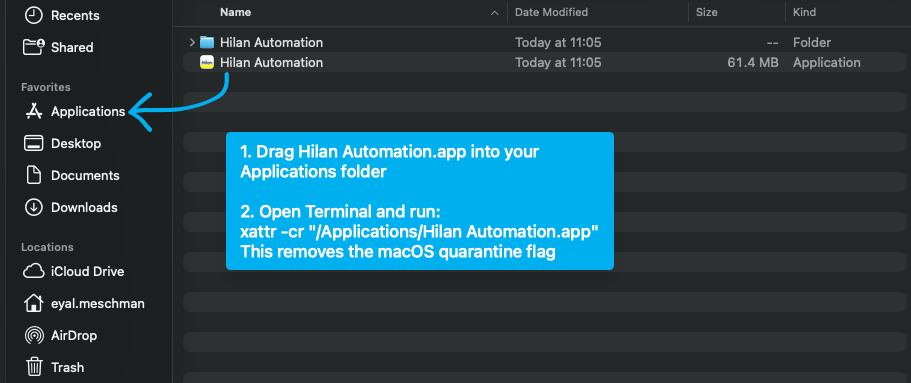
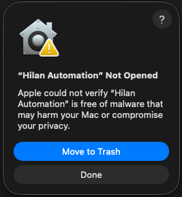
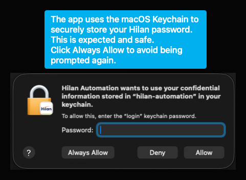
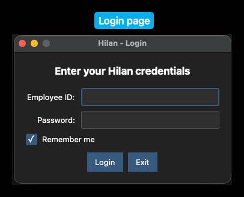
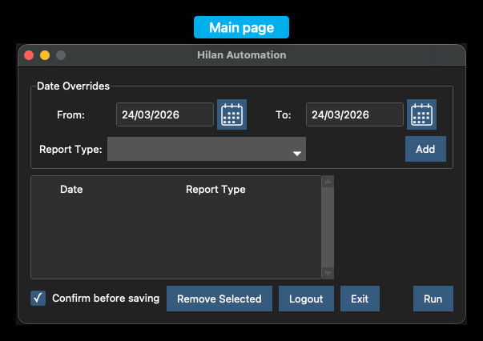

<p align="center">
  
</p>

# Hilan Automation

A macOS desktop app that automates filling Hilan (Tipalti) attendance reports. Instead of manually clicking through each day's report on the Hilan portal, this app logs in for you, reads pending reports, and fills them based on your schedule -- all through a simple GUI.

## Prerequisites

- **macOS** with Apple Silicon
- **Google Chrome** installed in the `/Applications` folder

## Download

Download the latest version from [GitHub Releases](https://github.com/EyalMeschman/hilan-automation/releases/download/v2.4.0/Hilan.Automation.zip).

1. Download `Hilan.Automation.zip`
2. Unzip it
3. Drag `Hilan Automation.app` to your Applications folder



4. Since the app isn't signed with an Apple Developer certificate, macOS will block it on first launch with a warning like this:



To fix this, open your **Terminal** and copy the following command:

```
xattr -cr "/Applications/Hilan Automation.app"
```

This removes the macOS quarantine flag, only needs to be done once.

### Keychain access prompt

When you open the app, macOS may ask for your Mac login password:



## Usage

### Login

On first launch, a short tutorial will walk you through the app, Follow the steps.

You'll be asked for your **Hilan Employee ID** and **password**.



Check **Remember me** to save your credentials locally:
- Username is stored in `~/.hilan-automation/config.json`
- Password is stored securely in your **macOS Keychain** (OPTIONAL: search for `hilan-automation` in Keychain Access to view or delete it)

### Main page



### Default schedule

Each workday is filled with a default report type:

| Day | Default |
|-----|---------|
| Sun (א), Wed (ד) | Work from Home (ע.בית) |
| Mon (ב), Tue (ג), Thu (ה) | Present (נכח) |

If this matches your schedule, no extra setup is needed.

### Date overrides

To report something other than the default (sick day, vacation, etc.):

1. Pick a **From** and **To** date
2. Choose a report type from the dropdown
3. Click **Add**

The overrides appear in the table and will be applied when the automation runs.

### Running the automation

Click **Run** to start. The app launches Chrome, logs into Hilan, and fills each pending report.

- Enable **Confirm before saving** to review each report before it's submitted
- Some report types (sick leave, child sick, etc.) require manual action on the Hilan page -- the app will pause and wait for you to complete it before continuing

### Settings

Your preferences (confirm before saving, tutorial flags) are stored in:

```
~/.hilan-automation/config.json
```

You can edit or delete this file at any time to reset your settings.
